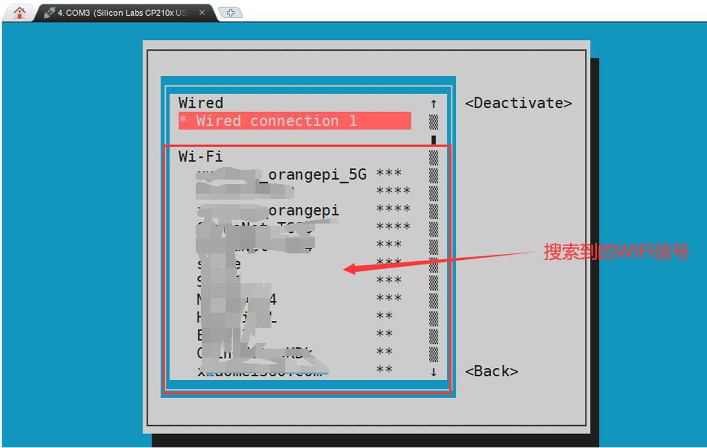
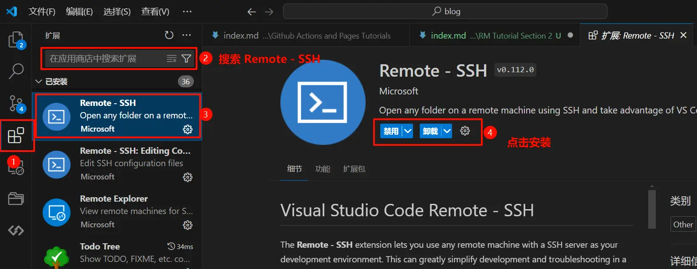

import Info from "@/components/mdx/Info.astro";
import Warning from "@/components/mdx/Warning.astro";

<Info>
  这是一篇偏实操导向的入门文档，适合第一次接触 OrangePi 和 RoboCup 视觉赛环境的同学。建议按“联网 -> 查 IP -> SSH -> Linux / Conda 基础”的顺序操作。
</Info>

# 前言

RoboCup 3D识别运行在嵌入式计算平台上，而这些平台几乎全部使用 Linux 系统。Linux 的优势在于它提供了稳定的服务器环境、成熟的开发工具链以及完整的网络能力，使得多机器人系统可以在同一套软件框架下运行。

在我们的 RoboCup3D 项目中，开发板实际上就是一台小型服务器。所有视觉算法、机器人决策程序、深度学习模型推理程序都会运行在这个系统中。因此，成员需要具备基本的 Linux 操作能力，包括远程连接、文件管理、程序编译和调试。

Linux 与 Windows 的最大区别在于，Linux 更强调命令行操作和远程管理。你并不需要在开发板上接显示器和键盘，而是可以通过自己的电脑远程控制开发板。这也是服务器开发的标准模式。

# OrangePi

## 开始之前检查硬件

在使用之前确保板子已经正常启动。要确认以下几件事。

香橙派已经正确接上电源。注意官方手册明确说明，板子上虽然有三个 Type-C 接口，但只有靠近 PWM 风扇接口的那个是 PD 电源口，另外两个不能给开发板供电，接错后会表现为板子不开机或异常启动。

## 连接Wifi

在命令行中输入nmtui命令打开wifi连接的界面。

```bash
(base) HwHiAiUser@orangepiaipro-20t:~$ sudo nmtui
```

输入nmtui命令打开的界面如下所示


选择`Activate a connect`后回车，然后就能看到所有搜索到的WIFI热点



选择想要连接的WIFI热点后再使用Tab键将光标定位到`Activate`后回车


然后会弹出输入密码的对话框，在Password内输入对应的密码然后回车就会开始连接WIFI


WIFI连接成功后会在已连接的WIFI名称前显示一个“\*”


使用ping命令可以测试wifi网络的连通性，ping命令可以通过Ctrl+C快捷键
来中断运行

```bash
(base) HwHiAiUser@orangepiaipro-20t:~$ ping www.orangepi.org -I wlan0
PING www.orangepi.org (123.57.147.237) from 10.31.2.93 wlan0: 56(84) bytes of data.
64 bytes from 123.57.147.237 (123.57.147.237): icmp_seq=1 ttl=53 time=47.1 ms
64 bytes from 123.57.147.237 (123.57.147.237): icmp_seq=2 ttl=53 time=44.3 ms
64 bytes from 123.57.147.237 (123.57.147.237): icmp_seq=3 ttl=53 time=45.0 ms
64 bytes from 123.57.147.237 (123.57.147.237): icmp_seq=4 ttl=53 time=71.0 ms
^C--- www.orangepi.org ping statistics--
4 packets transmitted, 4 received, 0% packet loss, time 3002ms
rtt min/avg/max/mdev = 44.377/51.902/71.082/11.119 ms
```

## 查询ip地址

在终端输入如下命令，可以查询当前wifi的ip地址，这条命令的作用是查看当前这台机器所有网络接口的信息。

```bash
ip a s wlan 0
```

运行结果如下，屏幕会出来很多内容，不需要全部看懂，只需要盯住含有 inet 的那一行。

```bash
(base) HwHiAiUser@orangepiaipro-20t:~$ ip a s wlan0
4: wlan0: <BROADCAST,MULTICAST,UP,LOWER_UP> mtu 1500 qdisc mq state UP
group default qlen 1000
  link/ether 54:f2:9f:7b:ba:36 brd ff:ff:ff:ff:ff:ff
  inet 10.31.2.93/16 brd 10.31.255.255 scope global dynamic noprefixroute wlan0
    valid_lft 43003sec preferred_lft 43003sec
  inet6 fe80::5297:7036:a33c:bb93/64 scope link noprefixroute
    valid_lft forever preferred_lft forever
```

真正重要的是

```bash
10.31.2.93
```

这就是香橙派当前在局域网中的 IPv4 地址。后面的 `/16` 不是地址本体，SSH 的时候不要把 `/16` 一起带上。除了 `ip a`，也可以在图形界面里看地址

在 Ubuntu 桌面右上角通常有网络图标。点击后进入网络设置，在有线网络或无线网络的详细信息里，通常能看到 IPv4 地址。这个地址和 `ip a` 查到的本质上是同一个东西。

# 安装VSCode

通过 Ubuntu 自带的火狐浏览器找到熟悉的 [VSCode](https://code.visualstudio.com/) 的官网，并且进行安装。

选择`.deb` 进行下载，下载完毕之后进入下载文件夹，应该可以看到下载的 deb 包，右键在终端中打开，输入：

```bash
sudo dpkg -i code_your_version.deb
```

其中 `code_your_version.deb` 为你的 deb 包的名字，在命令行中可以使用 TAB 进行自动补全，这样你就只需要输入一个 code，之后进行自动补全即可。

输入密码，其中密码的输入是不可见的，输入之后终端没有反应并非你没有输入，输入之后按下回车即可。

稍等片刻，等命令行又一次可以输入的时候，在命令行中输入 code，回车，进入 VSCode。

# SSH

<Warning>
  文中提到的默认密码仅适合首次接入或教学场景。实际队伍协作时，建议尽快修改默认密码，并避免把账号口令长期写在公开文档里。
</Warning>

在这里简短的介绍 SSH 语法，一般来说 SSH 安装在每一个系统中，无需额外的安装，在这里推荐使用 VSCode 的 SSH 插件

通过在 VSCode 的拓展栏进行搜索，可以很轻易地找到 VSCode 的 SSH 插件：



启用插件之后，点击左下角的打开远程窗口，选择连接到主机即可：


输入（下面是示例命令，不要直接照抄）

```bash
ssh username@192.168.1.XXX
```

输入香橙派账号默认密码`Mind@123`。连接成功后打开远程终端，执行并检查是否连接成功

> 注意，输入密码的时候，屏幕上是不会显示输入的密码的具体内容的，请不要
> 以为是有什么故障，输入完后直接回车即可

成功登录系统后的显示如下图所示


连接成功后建议执行以下命令，确认系统正常。

```bash
pwd
whoami
hostname
```

- `pwd`:查看当前路径
- `whoami`:查看当前用户
- `hostname`:查看主机名

如果这些命令能正常运行，恭喜你，说明 SSH 连接已经成功。

# Linux

使用 SSH 后，我们会进入正式的 Linux 系统中，同时，由于使用 SSH，此时的 Linux 并没有提供图形化界面（这也是 Linux 最原始的形态），因此在本章节中，我们会首先讲解一些基础的 Linux 指令，以便读者可以进行接下来的操作：

- `ls`：可以展示当前目录下的文件内容，其中显示隐藏内容需要使用 `ls -a`。
- `cd`：用法为 `cd folder`，可以前往指定的文件夹中，需要注明的是，.. 为上级目录，如想要前往上级，使用 `cd ..`，上级的上级，以此类推 `cd ../..`。

文档的编辑操作需要使用 vim，这一技巧具备一定的难度，读者请勿尝试指令 `vim filename`，若无法退出，请狂点 `esc` 之后依次按下 :, `w, q, !, Enter` 以保存并退出，若不希望保存，无需按下 `w`。

# Anaconda

由于香橙派已经内置了Anaconda环境，因此读者无需自行安装。在这章，我们会讲解一些常用的`Conda`命令和包管理技巧。

## 查看已有环境

首先可以查看当前系统中已有的 conda 环境。

在终端输入：

```bash
conda env list
```

或者

```bash
conda info --envs
```

运行结果类似

```bash
# conda environments:
#
base                  *  /home/root/anaconda3
robocup                  /home/root/anaconda3/envs/robocup
```

## 激活环境

如果需要进入某个环境，可以使用：

```bash
conda activate 环境名
```

例如：

```bash
conda activate robocup
```

进入环境后，终端前面通常会显示环境名称，例如：

```bash
(robocup) root@orangepiaipro-20t
```

这说明当前已经进入 `robocup` 环境。

如果想返回默认环境：

```bash
conda activate base
```

或者

```bash
conda deactivate
```

## 创建新的环境

如果需要为某个项目创建独立环境，可以使用：

```bash
conda create -n 环境名 python=版本
```

例如：

```bash
conda create -n vision python=3.10
```

创建完成后可以使用：

```bash
conda activate vision
```

进入该环境。

使用独立环境的好处是：不同项目可以使用不同版本的 Python 并且不同项目之间不会产生依赖冲突，此外，将环境隔离会让环境更容易管理。

## 安装 Python 包

在 conda 环境中安装 Python 包通常有两种方式。

第一种：使用 conda 安装

```bash
conda install numpy
```

第二种：使用 pip 安装

```bash
pip install numpy
```

一般来说：常见科学计算库推荐使用 `conda install`，但是一些 Python 库只能通过 `pip install` 安装

## 查看已安装的包

查看当前环境已经安装的包：

```bash
conda list
```

会列出所有 Python 库以及对应版本。

## 更新包

更新某个 Python 包：

```bash
conda update 包名
```

例如：

```bash
conda update numpy
```

## 导出环境

有时需要把当前环境分享给其他队员，可以导出环境配置。

```bash
conda env export > environment.yml
```

生成的 `environment.yml` 文件记录了当前环境的所有依赖。

其他人可以使用：

```bash
conda env create -f environment.yml
```

快速创建完全相同的环境。

# Git 

在一个大型开发项目中，代码通常需要多人协作开发，因此需要使用 **Git** 进行代码版本管理。Git 可以帮助我们记录代码历史、协作开发以及避免多人修改同一份代码时产生冲突。

如果没有 Git，团队开发时很容易出现以下问题：

- 不知道代码是谁修改的  
- 不知道某次修改是否引入了 bug  
- 多人修改同一文件产生覆盖  
- 无法回退到之前的版本  

因此，建议所有队员都通过 Git 管理代码，而不要直接通过文件拷贝的方式共享代码。


## 查看 Git 是否安装

在终端输入：

```bash
git --version
```

如果出现类似输出：

```
git version 2.xx.x
```

说明 Git 已经安装成功。

如果没有安装，可以使用：

```bash
sudo apt install git
```

进行安装。

## 克隆代码仓库

在开始开发之前，首先需要从远程仓库下载代码。

例如从 GitHub 或 GitLab 下载项目：

```bash
git clone 仓库地址
```

例如：

```bash
git clone https://github.com/xxx/robocup-vision.git
```

执行完成后，会在当前目录生成一个项目文件夹。

进入项目目录：

```bash
cd robocup-vision
```

## 查看当前代码状态

在开发过程中，可以使用：

```bash
git status
```

查看当前代码状态。

该命令可以显示：

* 哪些文件被修改
* 哪些文件还没有加入版本管理
* 当前所在的分支

这是开发过程中最常使用的命令之一。

## 添加文件到版本控制

当修改代码后，需要先将修改加入 Git 暂存区。

例如：

```bash
git add 文件名
```

例如：

```bash
git add main.cpp
```

如果想添加当前目录所有修改，可以使用：

```bash
git add .
```

## 提交代码

添加完成后，需要进行提交。

```bash
git commit -m "修改说明"
```

例如：

```bash
git commit -m "fix vision detection bug"
```

这里的引号中是对本次修改的简要说明，建议写清楚修改内容。


## 推送代码到远程仓库

提交完成后，需要将代码上传到远程仓库：

```bash
git push
```

这样其他队员才能看到你的代码更新。


## 更新远程代码

如果其他队员已经更新了代码，可以使用：

```bash
git pull
```

从远程仓库获取最新代码。

建议每次开发之前先执行：

```bash
git pull
```

以确保本地代码是最新版本。


## 查看代码历史

可以使用以下命令查看提交历史：

```bash
git log
```

该命令可以查看每一次提交的记录，包括：

* 提交人
* 提交时间
* 修改说明
## 常见开发流程

在团队开发中，推荐使用以下开发流程：

首先更新代码：

```bash
git pull
```

然后进行代码修改。

修改完成后：

```bash
git add .
git commit -m "修改说明"
```

最后上传代码：

```bash
git push
```


## 建议

在团队开发中建议遵守以下几点：

1. 每次提交前写清楚 commit 信息
2. 每次开发前先执行 `git pull`
3. 不要直接修改主分支的大量代码
4. 修改较大功能时建议创建新的分支

合理使用 Git 可以大大提高团队开发效率，并减少代码冲突。


# 服务器使用礼貌提示

由于 RoboCup 视觉开发板通常是多人共同使用的计算资源，因此在使用过程中需要注意一些基本的服务器使用规范，以避免影响其他队员的正常开发。

服务器资源包括：

* CPU
* 内存
* GPU / NPU
* 磁盘空间
* 网络带宽

如果使用不当，很容易影响其他人的实验或开发工作。因此在使用服务器时需要遵守一些基本的礼貌和规范。


## 不要长时间占用计算资源

在运行深度学习模型、训练程序或其他高计算负载任务时，请注意不要长时间占用服务器资源。

例如：

* 大规模训练任务
* 长时间推理任务
* 无限循环程序

如果需要运行长时间任务，建议提前与队友沟通。

可以使用以下命令查看当前运行的程序：

```bash
top
```

如果系统中安装了 `htop`，也可以使用：

```bash
htop
```

该命令可以更加直观地查看当前 CPU 和内存的使用情况。


## 使用完成后及时关闭程序

很多初学者在运行程序后会直接关闭 SSH 窗口，但程序实际上仍然在服务器上运行。

如果程序已经不再需要运行，应主动结束对应进程。

可以先查看当前进程：

```bash
top
```

找到对应程序的 **PID（进程ID）**，然后使用：

```bash
kill PID
```
例如：
```bash
kill 12345
```
这样可以避免程序长期占用服务器资源。


## 不要随意删除或修改他人的文件

服务器通常是多人共同使用的环境，因此不要随意删除或修改他人的代码、环境或数据。

如果需要清理空间，只删除自己目录下的文件。

一般来说，每个人应该主要在自己的目录中进行开发，例如：

```bash
/home/username/
```

不要在系统目录或公共目录下随意删除文件。

## 安装软件前尽量确认

在服务器上安装软件或 Python 库之前，建议先确认是否会影响现有环境。

例如：

* 不要随意修改系统 Python
* 不要随意删除 conda 环境
* 不要覆盖公共环境

如果需要安装新的 Python 库，建议在 **自己的 conda 环境** 中安装，而不是直接安装到系统环境中。


## 不要占满磁盘空间

服务器磁盘空间是共享资源，如果大量存储数据或模型，可能会影响其他人的使用。

可以使用以下命令查看磁盘空间：

```bash
df -h
```

如果产生大量临时数据（例如日志文件、训练数据、缓存等），建议定期清理。


## 离开服务器前检查程序

在关闭 SSH 或 VSCode 连接之前，建议确认自己启动的程序是否仍在运行。

例如：

```bash
top
```

如果程序已经不需要继续运行，请手动结束对应进程。


## 发现异常及时沟通

如果发现服务器出现以下情况，应及时通知队友或管理员：

* 系统运行明显变慢
* GPU / NPU 长时间被占用
* 无法 SSH 登录
* 磁盘空间耗尽

不要自行进行大规模系统修改，以免影响整个开发环境。


## 总结

服务器是团队共享资源，合理使用不仅能提高开发效率，也能避免很多不必要的问题。

简单来说，可以记住以下三点：

* 不乱删
* 不乱装
* 不长时间占用资源
